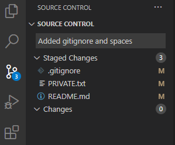

[This goes to the heading](#this-is-a-heading)  
# This Is a Heading  
*This is italic text*  
I said  
>This is a quote  

I used `git commit` to commit this file  
I used [this](https://docs.github.com/en/github/writing-on-github/basic-writing-and-formatting-syntax#headings) to build this site  
[This Goes to a screenshot](screenshots/Gitstuff.png)  
This is that screenshot:  
  
- A
- Unordered
- List
1. An
2. Ordered
3. List
- [ ] uncomplete task
- [x] complete task 